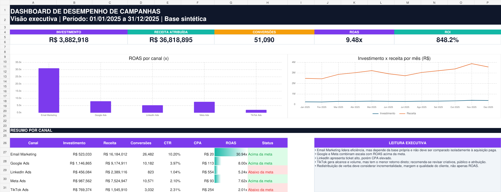
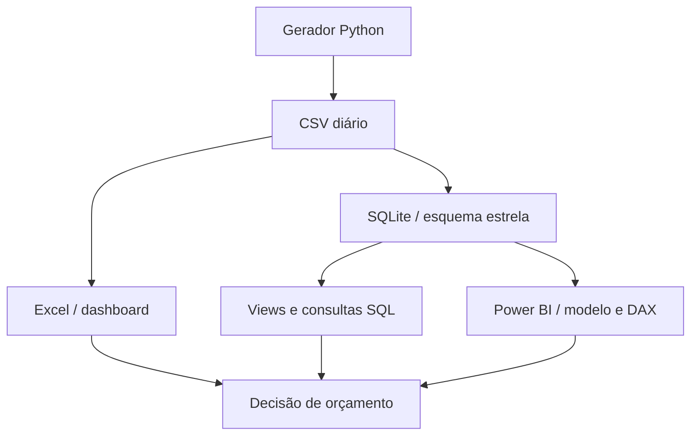

# Dashboard de Desempenho de Campanhas de Marketing

[](https://github.com/Gmerick/dashboard-desempenho-campanhas-marketing/actions/workflows/ci.yml)
[](outputs/e1212207ff9f/dashboard_campanhas_marketing.xlsx)
[](database/schema.sql)
[](powerbi/)

Projeto completo de portfólio para comparar canais, conversões, custos, receita e retorno sobre investimento. A solução combina uma base sintética reproduzível, modelagem SQL, dashboard executivo em Excel e especificação completa para Power BI.

> Os dados são sintéticos e não representam uma empresa real. O objetivo é demonstrar raciocínio analítico, modelagem, visualização e comunicação de recomendações.



## Resultado em uma frase

Com **R$ 3,88 milhões** investidos, as campanhas geraram **R$ 36,82 milhões** em receita atribuída, **51.090 conversões**, **ROAS de 9,48x** e **ROI de 848,23%**; Email liderou eficiência, enquanto TikTok ficou abaixo das metas de retorno.

## Objetivos

- consolidar o desempenho de campanhas em uma visão executiva;
- comparar canais sem confundir volume com eficiência;
- acompanhar o funil de impressões a novos clientes;
- medir CTR, taxas de conversão, CPC, CPL, CPA, ROAS e ROI;
- identificar campanhas a escalar, manter ou revisar;
- analisar sazonalidade mensal e uso do orçamento;
- entregar uma estrutura reproduzível e auditável para portfólio.

## Tecnologias

| Tecnologia | Aplicação no projeto |
|---|---|
| Excel | Dashboard, análises por canal/mês/campanha, metas editáveis e base auditável |
| SQL / SQLite | Esquema estrela, integridade, índices, views e 12 consultas de negócio |
| Power BI | Modelo, medidas DAX, tema visual e blueprint de quatro páginas |
| Python | Geração determinística da base, carga no SQLite e testes |
| GitHub Actions | Validação automática do dataset, funil, SQL e workbook |

## Principais KPIs

| Indicador | Resultado | Definição |
|---|---:|---|
| Impressões | 76.661.580 | Exibições dos anúncios |
| Cliques | 2.972.498 | Interações que abriram o destino |
| Leads | 358.853 | Contatos qualificados |
| Conversões | 51.090 | Vendas atribuídas |
| Novos clientes | 21.793 | Conversões de primeira compra |
| Investimento | R$ 3.882.917,82 | Custo de mídia |
| Receita atribuída | R$ 36.818.895,31 | Receita ligada às campanhas |
| CTR | 3,88% | Cliques ÷ impressões |
| Taxa de conversão | 14,24% | Conversões ÷ leads |
| CPA | R$ 76,00 | Investimento ÷ conversões |
| ROAS | 9,48x | Receita ÷ investimento |
| ROI | 848,23% | (Receita − investimento) ÷ investimento |

## Comparação de canais

| Canal | Conversões | Investimento | Receita | CPA | ROAS | ROI | Leitura |
|---|---:|---:|---:|---:|---:|---:|---|
| Email Marketing | 26.482 | R$ 523 mil | R$ 16,18 mi | R$ 19,75 | 30,94x | 2.994% | Maior eficiência; mídia própria |
| Google Ads | 10.182 | R$ 1,15 mi | R$ 9,17 mi | R$ 112,64 | 8,00x | 700% | Bom equilíbrio entre escala e retorno |
| Meta Ads | 10.571 | R$ 988 mil | R$ 7,52 mi | R$ 93,42 | 7,62x | 662% | Maior volume entre canais pagos |
| LinkedIn Ads | 823 | R$ 456 mil | R$ 2,39 mi | R$ 554,17 | 5,24x | 424% | Retorno positivo, CPA elevado |
| TikTok Ads | 3.032 | R$ 769 mil | R$ 1,55 mi | R$ 253,75 | 2,01x | 101% | Abaixo das metas de ROAS e ROI |

## Recomendações executivas

1. Testar aumento incremental de verba em `Pesquisa Marca` e `Remarketing Social`, que combinam CPA baixo e ROAS elevado.
2. Tratar Email separadamente de mídia paga, pois a base própria e o menor custo elevam o retorno.
3. Revisar LinkedIn com metas coerentes com o ticket B2B e qualidade de lead; CPA isolado pode subestimar valor futuro.
4. Redesenhar segmentação, criativo e objetivo do TikTok antes de escalar, sobretudo `Video Descoberta`.
5. Incluir margem, LTV e testes de incrementalidade antes de transformar receita atribuída em decisão financeira definitiva.

Veja a análise completa em [`reports/insights.md`](reports/insights.md).

## Arquitetura



O grão da tabela fato é **campanha por dia**. As dimensões de data, campanha e canal permitem filtragem consistente sem duplicar descrições na camada analítica.

## Estrutura do repositório

```text
.
├── data/
│   └── campaign_performance.csv
├── database/
│   ├── analytics_queries.sql
│   ├── build_database.py
│   ├── schema.sql
│   └── views.sql
├── docs/
│   ├── como_utilizar.md
│   ├── dicionario_dados.md
│   ├── metodologia.md
│   └── roteiro_entrevista.md
├── outputs/e1212207ff9f/
│   └── dashboard_campanhas_marketing.xlsx
├── powerbi/
│   ├── dashboard_layout.md
│   ├── data_model.md
│   ├── dax_measures.md
│   └── theme_marketing.json
├── reports/
│   ├── dashboard.png
│   └── insights.md
├── scripts/
│   ├── build_workbook.mjs
│   └── generate_data.py
└── tests/
    └── test_project.py
```

## Como executar

Requer Python 3.10 ou superior. Nenhuma biblioteca externa é necessária para gerar os dados, construir o banco e executar os testes.

```bash
git clone https://github.com/Gmerick/dashboard-desempenho-campanhas-marketing.git
cd dashboard-desempenho-campanhas-marketing
python scripts/generate_data.py
python database/build_database.py
python -m unittest discover -s tests -v
```

Também é possível executar `make data`, `make database` e `make test`.

### Excel

Abra [`dashboard_campanhas_marketing.xlsx`](outputs/e1212207ff9f/dashboard_campanhas_marketing.xlsx). O workbook possui:

- **Dashboard**: KPIs, gráficos e recomendações;
- **Analise_Canais**: eficiência e status contra metas;
- **Analise_Mensal**: investimento, receita, conversões e variação mensal;
- **Analise_Campanhas**: ranking detalhado;
- **Dados_Campanhas**: 4.380 registros auditáveis;
- **Metas_Dicionario**: metas editáveis e definições.

### SQL

Depois de criar o banco:

```bash
sqlite3 database/marketing_campaigns.db
```

```sql
.headers on
.mode column
SELECT * FROM vw_resumo_executivo;
SELECT * FROM vw_desempenho_canais ORDER BY roas DESC;
.read database/analytics_queries.sql
```

### Power BI

Este repositório inclui tudo que é necessário para reproduzir o relatório no Power BI Desktop:

1. importe o CSV ou o banco SQLite;
2. aplique o esquema de [`powerbi/data_model.md`](powerbi/data_model.md);
3. crie as medidas de [`powerbi/dax_measures.md`](powerbi/dax_measures.md);
4. importe [`powerbi/theme_marketing.json`](powerbi/theme_marketing.json);
5. construa as páginas conforme [`powerbi/dashboard_layout.md`](powerbi/dashboard_layout.md).

O arquivo `.pbix` não é versionado porque é um formato binário proprietário. O modelo, DAX, tema e especificação visual permanecem versionáveis, revisáveis e fáceis de recriar.

O guia completo está em [`docs/como_utilizar.md`](docs/como_utilizar.md).

## Qualidade e reprodutibilidade

- geração determinística com semente fixa;
- checagem do número de linhas, campanhas e canais;
- validação automática de todos os níveis do funil;
- restrições `CHECK`, chaves estrangeiras, unicidade e índices no SQLite;
- divisões protegidas com `NULLIF` no SQL e `DIVIDE` no DAX;
- workbook validado para erros de fórmula e revisado visualmente;
- CI no GitHub em cada push e pull request.

## Como apresentar em uma entrevista

Comece pelo problema, explique o modelo e só então mostre o dashboard. Um pitch possível:

> Desenvolvi uma análise de 12 campanhas e 5 canais para identificar onde o investimento de marketing gera mais valor. Modelei 4.380 registros em SQL, construí um dashboard executivo no Excel e documentei a solução equivalente em Power BI com medidas DAX. Encontrei ROAS total de 9,48x; Email liderou eficiência, Google e Meta equilibraram escala e retorno, e TikTok ficou abaixo da meta. A recomendação foi realocar verba gradualmente, respeitando saturação, ticket, qualidade do lead e limitações de atribuição. Também automatizei a geração dos dados e os testes de qualidade.

O roteiro de 5 minutos, perguntas técnicas e respostas sugeridas estão em [`docs/roteiro_entrevista.md`](docs/roteiro_entrevista.md).

## Premissas e limitações

- A base é sintética.
- Receita atribuída não prova causalidade.
- ROI considera investimento de mídia, não todos os custos do negócio.
- A comparação entre mídia própria e paga deve considerar custo total e intenção da audiência.
- Decisões reais devem adicionar margem, LTV, CAC, qualidade de lead e testes de incrementalidade.

Detalhes em [`docs/metodologia.md`](docs/metodologia.md) e campos em [`docs/dicionario_dados.md`](docs/dicionario_dados.md).

## Licença

Distribuído sob a licença MIT. Consulte [`LICENSE`](LICENSE).
