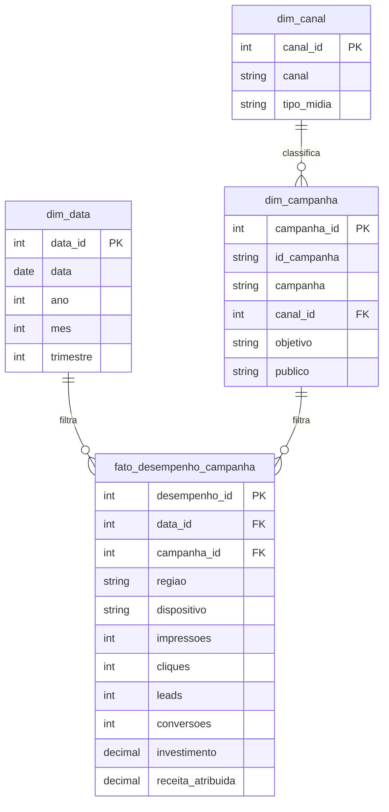

# Modelo de dados no Power BI

O projeto usa um esquema estrela. A tabela fato contém uma linha por campanha e dia; as dimensões descrevem datas, campanhas e canais.



## Opção A — importar do SQLite

1. Execute `python database/build_database.py`.
2. No Power BI Desktop, escolha **Obter Dados > Banco de dados SQLite**.
3. Se o conector não estiver disponível, instale o driver indicado pelo Power BI ou use a opção CSV abaixo.
4. Importe as quatro tabelas, sem importar as views.
5. Crie os relacionamentos abaixo com direção de filtro única.

| De | Campo | Para | Campo | Cardinalidade |
|---|---|---|---|---|
| `dim_data` | `data_id` | `fato_desempenho_campanha` | `data_id` | 1:* |
| `dim_campanha` | `campanha_id` | `fato_desempenho_campanha` | `campanha_id` | 1:* |
| `dim_canal` | `canal_id` | `dim_campanha` | `canal_id` | 1:* |

## Opção B — importar o CSV

Importe `data/campaign_performance.csv` e mantenha uma única tabela. Essa opção é mais simples para demonstrações, mas o esquema estrela é melhor para explicar modelagem dimensional em entrevistas.

Ao usar CSV:

- defina `data` como Data;
- use Número inteiro para impressões, cliques, leads, conversões e novos clientes;
- use Número decimal fixo para investimento, receita e orçamento;
- crie uma tabela calendário em DAX;
- marque a coluna de data da tabela calendário como tabela de datas.

```DAX
Calendario =
ADDCOLUMNS (
    CALENDAR (
        MIN ( fato_desempenho_campanha[data] ),
        MAX ( fato_desempenho_campanha[data] )
    ),
    "Ano", YEAR ( [Date] ),
    "MesNumero", MONTH ( [Date] ),
    "Mes", FORMAT ( [Date], "mmm" ),
    "Trimestre", "T" & FORMAT ( [Date], "Q" )
)
```

Classifique `Calendario[Mes]` por `Calendario[MesNumero]` para evitar ordem alfabética nos gráficos.
